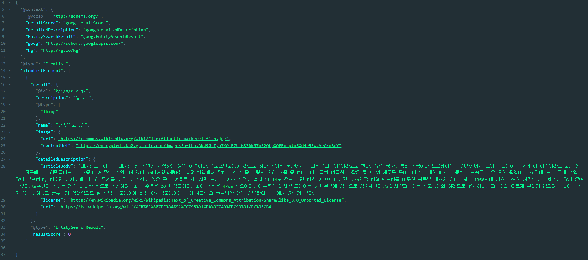

# 본 Repository에서는 Google Cloud Vision APi에 대해 작성하였습니다.
## Cloud Vision API Doucmentation
### Link: https://cloud.google.com/vision/docs/quickstarts
___
## 기본 요구사항
1. RESTFUL API지식(JSON형식으로 Request, Response를 할 수 있어야합니다.)
2. Google Cloud Vision설정에 대한 지식이 있어야합니다.
___
## 시작 전 Vision_API를 사용하기 위해 Request작성 이해
#### HTTP요청
```
POST https://vision.googleapis.com/v1/images:annotate
```
#### 요청본문(JSON 표현)
```json
{  
  "requests": [
    {
      "image": {
        "content": "string(image to Base64 code)",
        "source": {
            "gcsImageUri": "string(Google Cloud Storage URI)",
            "imageUri": "string(Access HTTP/HTTPs URI)"
        }
      },
      "features": [
        {
          "maxResults": "number",
          "type": "Enum(Type) Reference Link: https://cloud.google.com/vision/docs/reference/rest/v1/Feature#Type",
          "model": "string(builtin/stable or builtin/latest)"
        }
      ],
      "imageContext": {
        "latLongRect": {
          "minLating":{
            "langtitude": "number(range(-90, 90))",
            "longtitude": "number(range(-180, 180))"
          },
          "maxLating":{
            "langtitude": "number(range(-90, 90))",
            "longtitude": "number(range(-180, 180))"
          }
        },
        "languageHints": [
          "string"
        ],
        "cropHintsParams": {
          "aspectRatios":[
            "number"
          ]
        },
        "productSearchParams": {
          "boundingPoly": {
            "verticies":[
              {
                "x": "number",
                "y": "number"
              }
            ],
            "normalizedVertices":[
              {
                "x": "number",
                "y": "number"
              }
            ]
          },
          "productSet": "string",
          "productCategories": [
            "string"
          ],
          "filter": "string"
        },
        "webDetectionParams": {
          "includeGeoResults": "boolean"
        },
        "textDetectionParams": {
          "enableTextDetectionConfidenceScore": "boolean"
        }
      }
    }
  ]
}
```
- 필수 JSON key값
1. image(content or source(gcsImageUri or ImageUri))
2. feature(type and maxResult)
- Request 값 이해(차후 업데이트 예정)
___
## 사용할 feature Type(WebDetection)
### Link: https://cloud.google.com/vision/docs/detecting-web
___
### ex. 테스트해볼 이미지(카니발 이미지)

### 요청본문 REQUEST POST
```json
{
  "requests": [
    {
      "features": [
        {
          "type": "WEB_DETECTION"
        }
      ],
      "image": {
        "source": {
          "gcsImageUri": "gs://cloud-samples-data/vision/web/carnaval.jpeg"
        }
      },
      "imageContext": {
        "webDetectionParams": {
          "includeGeoResults": true
        }
      }
    }
  ]
}
```
### 응답 본문(너무 많은 관계로 각 결과 2개씩만 자름) RESPONSE
```json
{
  "responses": [
    {
      "webDetection": {
        "webEntities": [
          {
            "entityId": "/g/11c47fvr88",
            "score": 1.2966361,
            "description": "Carnival in Rio de Janeiro 2020"
          },
          {
            "entityId": "/g/11c4769n5h",
            "score": 1.2902837,
            "description": "Carnival in Rio de Janeiro 2019"
          }
        ],
        "fullMatchingImages": [
          {
            "url": "https://triniinxisle.com/wp-content/uploads/2019/01/Carnival-Budget.jpg"
          },
          {
            "url": "https://api.hispanicoutlook.com/media/uploads/2022/02/22/carnival-in-uruguay-hispanic-outlook-magazine.jpg"
          }
        ],
        "partialMatchingImages": [
          {
            "url": "https://triniinxisle.com/wp-content/uploads/2019/01/Carnival-Budget-1024x683.jpg"
          },
          {
            "url": "https://blog.giftbasketsoverseas.com/wp-content/uploads/2018/09/quinten-de-graaf-278848-unsplash1-1024x683.jpg"
          }
        ],
        "pagesWithMatchingImages": [
          {
            "url": "https://www.intrepidtravel.com/us/brazil/rio-carnival-122873",
            "pageTitle": "\u003cb\u003eRio Carnival\u003c/b\u003e Experience | Intrepid Travel US",
            "partialMatchingImages": [
              {
                "url": "https://www.intrepidtravel.com/sites/intrepid/files/styles/large/public/elements/product/hero/GGSR-Brazil-rio-carnival-ladies.jpg"
              }
            ]
          },
          {
            "url": "https://www.youtube.com/watch?v=moF6PSNIqDQ",
            "pageTitle": "\u003cb\u003eRIO CARNIVAL\u003c/b\u003e 2021 - Carnaval de Rio de Janeiró - Samba Music",
            "partialMatchingImages": [
              {
                "url": "https://i.ytimg.com/vi/moF6PSNIqDQ/mqdefault.jpg"
              }
            ]
          }
        ],
        "visuallySimilarImages": [
          {
            "url": "https://blog.busuu.com/wp-content/uploads/2018/02/ThinkstockPhotos-913874164-1-2.jpg"
          },
          {
            "url": "https://media.istockphoto.com/photos/people-in-costume-celebrates-carnival-in-brazil-picture-id1361307991?k=20&m=1361307991&s=612x612&w=0&h=TAqIQVzKn1kf8mgIIWzh_Qm96r1kEn1Ty02C8m9nL-0="
          }
        ],
        "bestGuessLabels": [
          {
            "label": "brazil carnival",
            "languageCode": "en"
          }
        ]
      }
    }
  ]
}
```
___
### 사용할 JSON 데이터 webDetection → webEntities → entityId
```json
{
  "responses": [
    {
      "webDetection": {
        "webEntities": [
          {
            "entityId": "/g/11c47fvr88",
            "score": 1.2966361,
            "description": "Carnival in Rio de Janeiro 2020"
          },
          {
            "entityId": "/g/11c4769n5h",
            "score": 1.2902837,
            "description": "Carnival in Rio de Janeiro 2019"
          }
        ],
      }
    }
  ]
}
```
### entityId = m_id(Machinelearning ID)
### Google KgSearch를 통해 해당되는 설명을 얻을 수 있음 Link: https://developers.google.com/knowledge-graph
```
GET https://kgsearch.googleapis.com/v1/entities:search?ids={m_id}&key={YOUR_API_KEY}&limit={num}&indent=True
```
___
### 최종 KgSearch를 통해 얻은 API결과물
